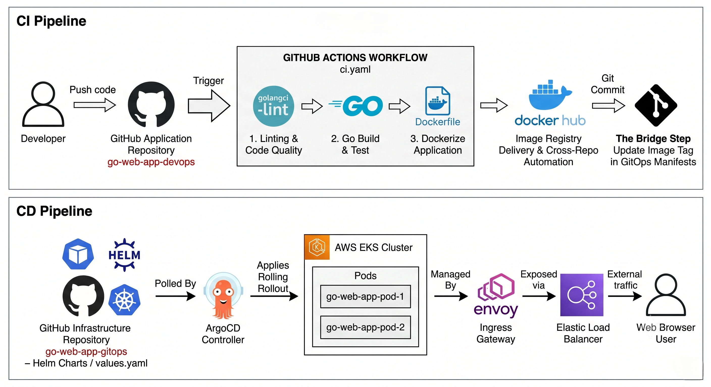

# Go Web Application DevOps Project

This repository contains a Go-based web application featuring a complete, automated CI/CD pipeline using modern DevOps practices and GitOps principles. 

---

## Architecture Overview

The infrastructure is split into two distinct automation pipelines: Continuous Integration (CI) and Continuous Delivery (CD) utilizing GitOps.



---

## CI Pipeline (Continuous Integration)

The CI pipeline is triggered automatically whenever a developer pushes code to the application repository. It runs via **GitHub Actions** (`ci.yaml`) and executes the following steps:

1. **Linting & Code Quality:** Uses `golangci-lint` to ensure code quality and adherence to best practices.
2. **Go Build & Test:** Compiles the application and runs unit tests to verify stability.
3. **Dockerize Application:** Packages the Go application into a lightweight Docker image using a `Dockerfile`.
4. **Image Registry Delivery:** Pushes the built image to **Docker Hub**.
5. **The Bridge Step:** Automatically updates the container image tag inside the GitOps infrastructure repository to trigger the deployment.

---

## CD Pipeline (Continuous Delivery & GitOps)

The deployment strategy follows a declarative GitOps model to manage cloud infrastructure:

* **Infrastructure Repository:** A separate repository (`go-web-app-gitops`) holds the Kubernetes manifests, Helm charts, and `values.yaml` configurations.
* **ArgoCD Controller:** Continuously polls the GitOps repository for changes. When a new image tag is detected, it automatically applies a **Rolling Rollout** to the target cluster.
* **Orchestration:** Deployed on an **AWS EKS Cluster** managing the application pods (`go-web-app-pod-1`, `go-web-app-pod-2`).
* **Ingress & Traffic Routing:** 
  * Managed internally by an **Envoy Ingress Gateway**.
  * Exposed to external traffic via an **AWS Elastic Load Balancer**.
  * Accessible securely by end users through any standard web browser.

---

## Tech Stack

* **Language:** Go (Golang)
* **CI/CD & Automation:** GitHub Actions, ArgoCD
* **Containerization & Orchestration:** Docker, Kubernetes, Helm
* **Cloud & Networking:** AWS EKS, Envoy Ingress Gateway, AWS Elastic Load Balancer

# Go Web Application

This is a simple website written in Golang. It uses the `net/http` package to serve HTTP requests.

## Running the server

To run the server, execute the following command:

```bash
go run main.go
```

The server will start on port 8080. You can access it by navigating to `http://localhost:8080/courses` in your web browser.

## Looks like this


